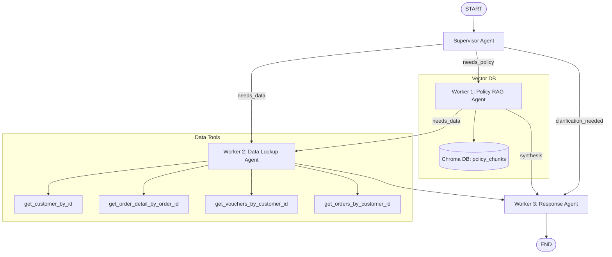

# VinShop Multi-Agent Shopping Customer Assistant & Visualization Dashboard

Hệ thống Trợ lý Hỗ trợ Khách hàng Đa Tác Nhân (Multi-Agent Shopping Customer Assistant) tích hợp giao diện trực quan Dashboard hiện đại, được xây dựng trên nền tảng **LangGraph**, **Chroma Vector DB**, **Sentence Transformers**, và **FastAPI**.

Hệ thống tự động phân loại, truy vấn điều hướng, tìm kiếm luật chính sách bán hàng (RAG), tra cứu lịch sử mua hàng từ cơ sở dữ liệu giả lập để tổng hợp câu trả lời chính xác, kèm theo dẫn chứng (evidence) và nguồn trích dẫn chi tiết cho khách hàng.

---

## 1. Kiến Trúc Hệ Thống (Multi-Agent Architecture)

Hệ thống được tổ chức thành một đồ thị có hướng (StateGraph) gồm 4 Tác nhân chính (Agents/Workers) phối hợp nhịp nhàng:



*   **Supervisor Agent**: Đóng vai trò bộ não điều phối, phân tích câu hỏi của khách hàng để quyết định luồng đi (cần tra cứu chính sách, dữ liệu đơn hàng/voucher hay cần yêu cầu khách hàng bổ sung mã ID).
*   **Worker 1 (Policy Worker)**: Thực hiện tìm kiếm ngữ nghĩa (semantic search) trên **Chroma DB** chứa các phân đoạn chính sách bán hàng (đã được chunking chuẩn cấu trúc `H2 + H3 + Content` bằng mô hình `all-MiniLM-L6-v2`), trích xuất thông tin kèm trích dẫn (citation).
*   **Worker 2 (Data Lookup Worker)**: Sử dụng mô hình ReAct agent để tự động gọi 4 công cụ (Tools) truy vấn cơ sở dữ liệu khách hàng, đơn hàng và voucher.
*   **Worker 3 (Response Worker)**: Tổng hợp tất cả thông tin thu thập được từ các Worker để đưa ra câu trả lời cuối cùng bằng tiếng Việt theo định dạng chuẩn, kèm theo nguồn dẫn chứng rõ ràng.

---

## 2. Cài Đặt và Khởi Tạo Môi Trường

### Bước 1: Khởi tạo Virtual Environment và kích hoạt
Mở terminal tại thư mục gốc của dự án:
```powershell
python -m venv .venv
.venv\Scripts\activate
```

### Bước 2: Cài đặt các thư viện dependencies
Cài đặt toàn bộ thư viện cần thiết cho Agent và Web Server:
```powershell
pip install -r src/requirements.txt
pip install fastapi
```

### Bước 3: Cấu hình File Môi Trường (`.env`)
Tạo hoặc chỉnh sửa file `.env` ở thư mục gốc dự án để cấu hình API Key. Ví dụ cấu hình cho nhà cung cấp dịch vụ LLM (như DeepSeek hoặc OpenAI/Gemini):
```env
LLM_PROVIDER=custom
LLM_MODEL=deepseek-chat
CUSTOM_API_KEY=your_deepseek_api_key
CUSTOM_API_BASE=https://api.deepseek.com/v1
```

---

## 3. Cách Sử Dụng Chương Trình

Hệ thống hỗ trợ 2 phương thức vận hành chính: **Giao diện Dòng lệnh (CLI)** và **Giao diện Web Trực quan (Web Dashboard)**.

### 3.1. Vận Hành Qua Dòng Lệnh (CLI)

#### Chạy thử nghiệm một câu hỏi đơn lẻ:
```powershell
.venv\Scripts\python.exe -m app.cli --question "Đơn hàng 2058 còn trong thời gian trả hàng không?"
```

#### Chạy đánh giá hàng loạt (Batch Evaluation) trên bộ 22 câu hỏi mẫu:
```powershell
.venv\Scripts\python.exe -m app.cli --batch
```
Lệnh này sẽ tự động chạy toàn bộ các câu hỏi trong [data/test.json](file:///d:/VinUni/Day09/2A202600953_NgoMinhKhanh_Day09/data/test.json), so sánh kết quả thực tế với mong muốn, tính toán tỉ lệ pass rate và xuất file thống kê [summary.json](file:///d:/VinUni/Day09/2A202600953_NgoMinhKhanh_Day09/src/artifacts/traces/summary.json) kèm vết lịch sử của từng câu hỏi.

---

### 3.2. Vận Hành Giao Diện Web Dashboard (Khuyên dùng)

Giao diện Dashboard giúp bạn trực quan hóa hoạt động của hệ thống Agent một cách sinh động nhất.

#### Khởi động Web API Server:
```powershell
.venv\Scripts\python.exe -m uvicorn --app-dir src app.server:app --port 8000 --reload
```

Sau khi chạy lệnh trên, bạn mở trình duyệt và truy cập:
👉 **[http://localhost:8000](http://localhost:8000)**

#### Các tính năng chính trên Web Dashboard:
1.  **Trợ lý Chat (Interactive Chat & Graph Visualizer)**:
    *   Nhập câu hỏi và gửi hoặc chọn các câu hỏi mẫu gợi ý.
    *   **Sơ đồ LangGraph động**: Theo dõi các nút Agent nào được kích hoạt thời gian thực. Các đường dẫn nối giữa các nút sẽ tự động sáng màu neon khi dữ liệu được truyền qua.
    *   **Inspector Logs**: Nhấp chuột vào bất kỳ nút nào trên sơ đồ để xem chi tiết prompt hệ thống, kết quả RAG, lịch sử tool gọi database hoặc nội dung tổng hợp.
2.  **Cơ sở Dữ liệu (Mock DB Browser)**:
    *   Duyệt danh sách Khách hàng, Đơn hàng, Voucher dạng bảng chuyên nghiệp.
    *   Tìm kiếm nhanh thông tin thực thể trực tiếp trên bảng.
3.  **Chính sách RAG (RAG Corpus Browser)**:
    *   Xem toàn bộ các khối văn bản (chunks) đã được bóc tách từ tài liệu chính sách.
    *   Tìm kiếm ngữ nghĩa cục bộ để kiểm tra các phần trích dẫn (citations).
4.  **Đánh giá Batch (Evaluation Panel)**:
    *   Theo dõi biểu đồ tỉ lệ đạt, số lượng test case thành công/thất bại.
    *   Kích hoạt chạy lại toàn bộ Suite 22 câu test trực tiếp bằng một cú click chuột.
    *   Nhấp vào nút kính lúp của bất kỳ câu hỏi nào để xem Modal phân tích sâu log lịch sử.

---

## 4. Cấu Trúc Thư Mục Dự Án

```text
├── data/
│   ├── order_customer_mock_data.json  # Cơ sở dữ liệu khách hàng thô
│   ├── policy_mock_vi.md              # Văn bản luật chính sách của hệ thống
│   └── test.json                      # Bộ 22 câu hỏi đánh giá hệ thống
├── src/
│   ├── app/
│   │   ├── static/                    # Mã nguồn giao diện Web Frontend
│   │   │   ├── index.html
│   │   │   ├── index.css
│   │   │   └── app.js
│   │   ├── cli.py                     # Entrypoint CLI chạy dòng lệnh
│   │   ├── config.py                  # Tự động nạp cấu hình từ .env
│   │   ├── data_access.py             # Khởi tạo chỉ mục và xuất 4 tools database
│   │   ├── graph.py                   # Biên dịch StateGraph và luồng routing
│   │   ├── prompts.py                 # Tách biệt prompt hệ thống của các Agent
│   │   └── server.py                  # Web API Server (FastAPI)
│   ├── provider/                      # Abstraction kết nối mô hình ngôn ngữ
│   ├── rag/                           # Logic tách dòng markdown & vector store Chroma
│   └── requirements.txt               # Thư viện yêu cầu cài đặt
├── .vscode/
│   └── settings.json                  # Tự động nạp biến môi trường .env trong terminal
├── Rubric.md                          # Tiêu chí chấm điểm của bài Lab
└── README.md                          # Hướng dẫn và tổng quan dự án
```
